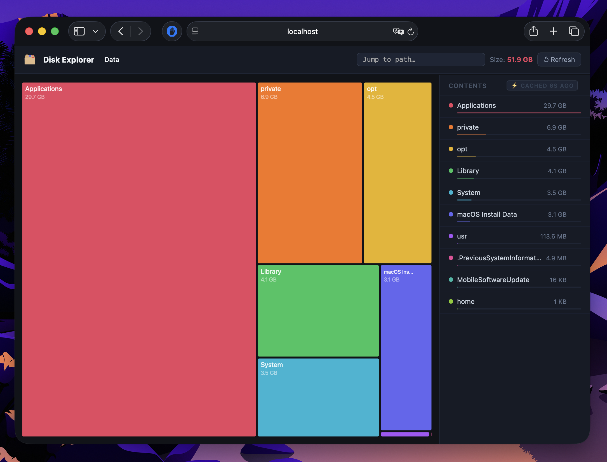

# disko

**Interactive disk usage explorer**

[](https://www.python.org/downloads/)
[](LICENSE)
[](https://github.com/johnib/disko)

---



---

## Features

- **Parallel scanning** — scans your filesystem with 12 concurrent workers for fast results on large trees
- **Real-time streaming** — directory sizes stream to the browser live via Server-Sent Events (SSE) as the scan progresses
- **Persistent cache with background refresh** — previously scanned paths load instantly; stale data is refreshed in the background without blocking the UI
- **Zoomable D3.js treemap** — navigate disk usage visually; click any node to zoom in and explore
- **Breadcrumb navigation** — always know where you are in the tree and jump back to any ancestor in one click
- **Per-folder refresh** — re-scan any individual folder on demand without restarting the server
- **Path jump bar** — type any absolute path to jump directly to it
- **Zero Python dependencies** — runs entirely on the standard library; no `pip install` required

---

## Requirements

- Python 3.8 or later
- macOS or Linux
- A modern web browser (Chrome, Firefox, Safari, or Edge)

---

## Quick Start

```bash
git clone https://github.com/johnib/disko.git
cd disko
python3 disko.py
```

disko will start a local web server and open your browser automatically.

---

## CLI Reference

```
python3 disko.py [OPTIONS]
```

| Option | Default | Description |
|---|---|---|
| `--port PORT` | `8080` | Port for the local web server |
| `--path PATH` | `$HOME` | Root directory to scan |
| `--no-browser` | — | Start the server without opening a browser tab |
| `--help` | — | Show help and exit |

**Examples:**

```bash
# Scan a specific directory on a custom port
python3 disko.py --path /var/log --port 9000

# Run headlessly (useful in SSH sessions)
python3 disko.py --path /data --no-browser
```

---

## How It Works

1. **Scanning** — `concurrent.futures.ThreadPoolExecutor` (12 workers) walks the directory tree in parallel, collecting file sizes.
2. **Streaming** — as each directory is sized, the result is pushed to the browser over an SSE (`text/event-stream`) connection so the treemap updates in real time.
3. **Visualization** — the browser renders an interactive, zoomable treemap using [D3.js](https://d3js.org/). Node area is proportional to disk usage.
4. **Cache** — completed scan results are serialized to JSON and written to `~/.disko_cache.json`. On subsequent runs, the cached data is served immediately while a background refresh runs concurrently.

---

## Cache

| Detail | Value |
|---|---|
| Location | `~/.disko_cache.json` |
| Version control | git-ignored by default |
| Clear cache | `rm ~/.disko_cache.json` |

The cache stores one entry per scanned root path. Entries are keyed by absolute path and include a timestamp used to determine staleness.

---

## Contributing

Contributions are welcome. Please read [CONTRIBUTING.md](CONTRIBUTING.md) for guidelines on how to open issues, submit pull requests, and run the test suite.

---

## License

MIT License. Copyright (c) Jonathan Ba.

See [LICENSE](LICENSE) for the full text.
