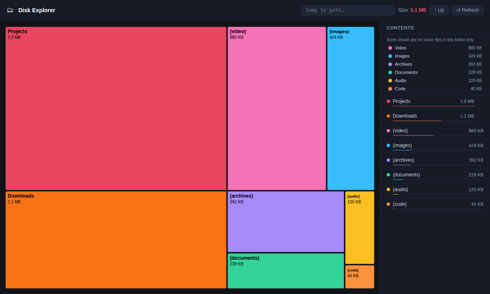

# disko

**Interactive disk usage explorer**

[](https://www.python.org/downloads/)
[](LICENSE)
[](https://github.com/johnib/disko)

---



---

## Features

- **Parallel scanning** — sizes each subfolder with up to 12 concurrent `du` processes per scan for fast results on large trees
- **Real-time streaming** — directory sizes stream to the browser live via Server-Sent Events (SSE) as the scan progresses
- **Persistent cache with background refresh** — previously scanned folders load instantly from the cache, then are silently re-scanned in the background without blocking the UI
- **Zoomable D3.js treemap** — navigate disk usage visually; click any node to zoom in and explore
- **Breadcrumb navigation** — always know where you are in the tree and jump back to any ancestor in one click
- **Per-folder refresh** — re-scan any individual folder on demand without restarting the server
- **Path jump bar** — type any absolute path to jump directly to it
- **Zero Python dependencies** — runs entirely on the standard library; no `pip install` required

---

## Requirements

- Python 3.9 or later
- macOS or Linux
- A modern web browser (Chrome, Firefox, Safari, or Edge)

---

## Quick Start

```bash
git clone https://github.com/johnib/disko.git
cd disko
python3 disko.py
```

disko will start a local web server and open your browser automatically.

---

## CLI Reference

```
python3 disko.py [OPTIONS]
```

| Option | Default | Description |
|---|---|---|
| `--port PORT` | `8765` | Port for the local web server (binds to `localhost`) |
| `--path PATH` | `~` (your home directory) | Starting directory to explore |
| `--no-browser` | — | Start the server without opening a browser tab |
| `--help` | — | Show help and exit |

**Examples:**

```bash
# Scan a specific directory on a custom port
python3 disko.py --path /var/log --port 9000

# Run headlessly (useful in SSH sessions)
python3 disko.py --path /data --no-browser
```

---

## How It Works

1. **Scanning** — disko lists the immediate children of the current folder. Each subfolder is sized by running `du -sk` (staying on one filesystem) in a `concurrent.futures.ThreadPoolExecutor` with 12 workers per scan. Loose files directly in the folder are summed with `stat` and shown as a single "(loose files)" tile.
2. **Streaming** — as each subfolder is sized, the result is pushed to the browser over an SSE (`text/event-stream`) connection so the treemap updates in real time.
3. **Visualization** — the browser renders an interactive, zoomable treemap using [D3.js](https://d3js.org/). Node area is proportional to disk usage.
4. **Prefetch** — after a scan, the 10 largest subfolders are scanned in the background by a shared pool of 4 prefetch workers (and so on recursively), so drilling down is usually instant.
5. **Cache** — every completed folder scan is stored in `~/.disko_cache.json`. When you open a cached folder, the cached result is served immediately and the folder is re-scanned in the background to update the cache.

---

## Cache

| Detail | Value |
|---|---|
| Location | `~/.disko_cache.json` (in your home directory, outside the repository; override with the `DISKO_CACHE` environment variable) |
| Clear cache | `rm ~/.disko_cache.json` |

The cache stores one entry per scanned folder (including prefetched folders). Entries are keyed by absolute path and hold the folder's immediate children with their sizes, plus a `scanned_at` timestamp that the UI shows as the scan time.

---

## Contributing

Contributions are welcome. Please read [CONTRIBUTING.md](CONTRIBUTING.md) for guidelines on how to open issues, submit pull requests, run the unit tests, and manually test your changes.

---

## License

MIT License. Copyright (c) [Jonathan Barazany](https://barazany.dev).

See [LICENSE](LICENSE) for the full text.
